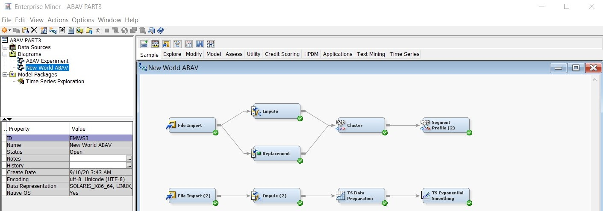
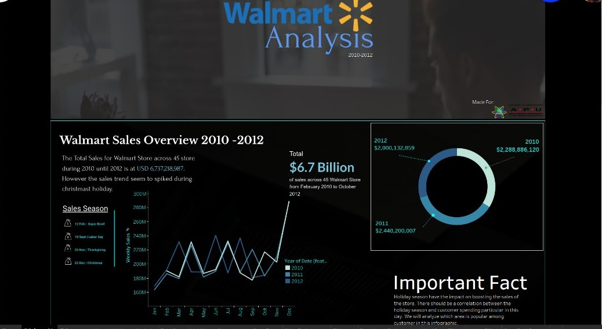
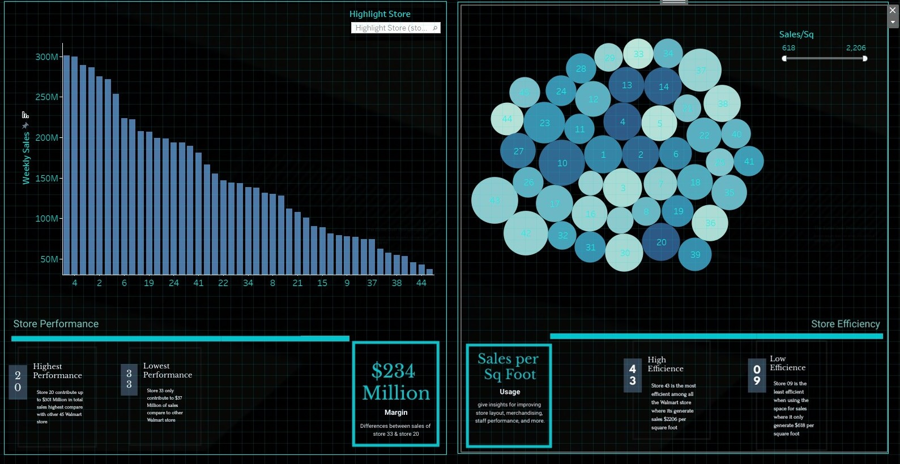
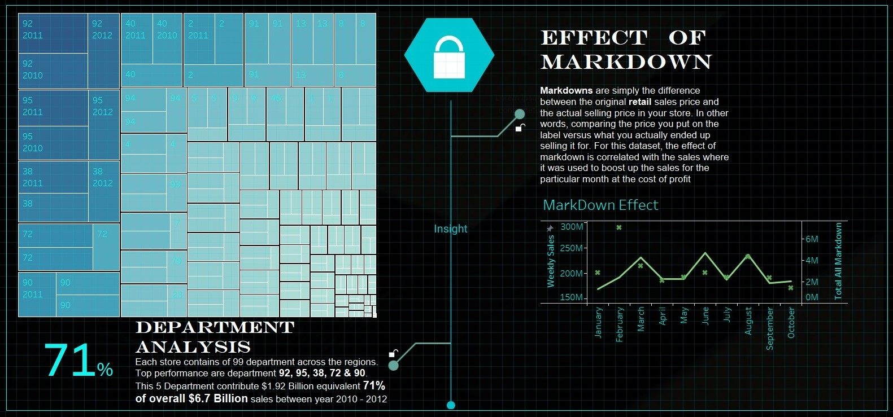
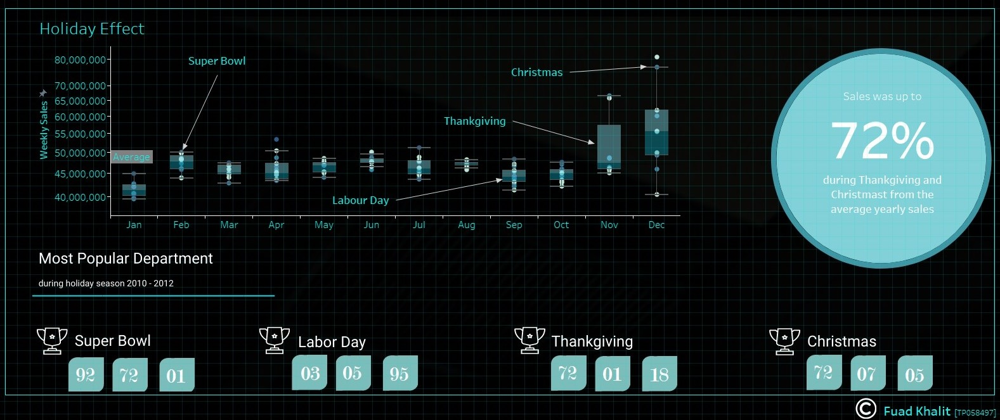

# Walmart_Sales_Forecast
Using kaggle dataset of 'Walmart Store Sales Forecasting' and utilize Tableau data visualization to generate holiday analysis infographic for exploratory data analysis (EDA). Created time series model using SAS Enterprise Miner to forecasting sales.
 

 
  Tableau Repository :- https://public.tableau.com/views/ABAV_Assignment/WalmartAnalysis?:language=en&:display_count=y&publish=yes&:origin=viz_share_link

